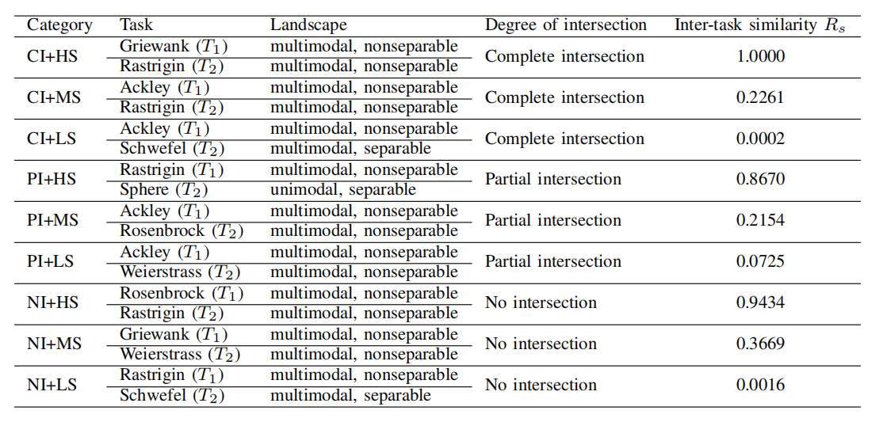

# CEC2017MTO
Problem Difficulty Classification
| Difficulty Mode | Training Set | Testing Set |
|-----------------|--------------|-------------|
| **easy** | 0, 1, 2, 3, 4, 5 | 6, 7, 8 |
| **difficult** | 6, 7, 8 | 0, 1, 2, 3, 4, 5 |

*Note: When `difficulty` is 'all', both training and testing sets contain all problems (0-8).*

---

CEC2017MTO comprises 9 multi-task problem instances, each of which contains two basic problems. Optional basic problems include Shpere, Rosenbrock, Ackley, Rastrigin, Griewank, Weierstrass and Schwefel, with dimension ranging from 25D~50D.

- Paper："[Evolutionary multitasking for single-objective continuous optimization: Benchmark problems, performance metric, and baseline results.](https://arxiv.org/abs/1706.03470)" arXiv preprint arXiv:1706.03470 (2017).
- Code Resource： [CEC2017MTO](http://www.bdsc.site/websites/MTO/index.html)
- Details
  

    
  

In MetaBox, we give three benchmark split difficulty mode of both train and test from the nine tasks of CEC2017 as **easy**, **difficult** and **full**. The benchmark split criterion is according to the complexity of degree of intersection and inter-task similarity.  
- **"easy"**:  train:[1,2,3,4,5,6] test:[7,8,9]  
- **"difficult"**:  train:[7,8,9] test:[1,2,3,4,5,6]  
- **"full"**:  train:[1,2,3,4,5,6,7,8,9]  test:[1,2,3,4,5,6,7,8,9]
