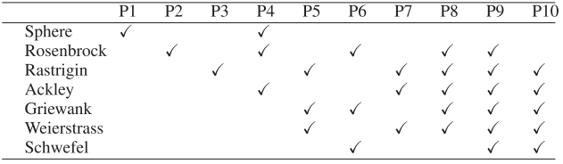

# WCCI2020
Problem Difficulty Classification
| Difficulty Mode | Training Set | Testing Set |
|-----------------|--------------|-------------|
| **easy** | 0, 1, 2, 3, 4, 5 | 6, 7, 8, 9 |
| **difficult** | 6, 7, 8, 9 | 0, 1, 2, 3, 4, 5 |

*Note: When `difficulty` is 'all', both training and testing sets contain all problems (0-9).*

---

WCCI2020 comprises 10 multi-task problem instances, each of which contains 50 basic problems. Optional basic problems include Shpere, Rosenbrock, Ackley, Rastrigin, Griewank, Weierstrass and Schwefel, which are all 50D.

- Paper：[WCCI2020](http://www.bdsc.site/websites/MTO_competition_2020/MTO_Competition_WCCI_2020.html)
- Code Resource： [WCCI2020](http://www.bdsc.site/websites/MTO/index.html)
- Details
  

    
  

<!-- 
In MetaBox, we give three benchmark split difficulty mode of both train and test from the ten tasks of WCCI2020 as **easy**, **difficult** and **full**. The benchmark split criterion is according to the richness of the composition of the basic functions.  
- **"easy"**: train:[1,2,3,4,5,6] test:[7,8,9,10]  
- **"difficult"**:  train:[7,8,9,10] test:[1,2,3,4,5,6]  
- **"full"**:  train:[1,2,3,4,5,6,7,8,9,10]  test:[1,2,3,4,5,6,7,8,9,10] -->
