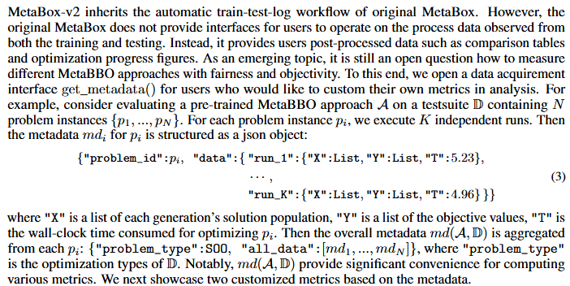

# Flexible Usage of Metadata

## 1. the concept of the Metadata
<p align="center">
  
</p>

## 2. save/load your metadata for a testing procedure
Suppose you want to  test a checkpoint of GLEET on all test problem isntances in bbob-10D-difficult, MetaBox-v2 will automatically record and organize the process data as the metadata and saves it to a file you indicate.
```python
from metaevobox import Tester, Config, construct_problem_set, get_baseline
from metaevobox.baseline.metabbo import *
from metaevobox.baseline.bbo import *
from metaevobox.environment.optimizer import *

config = {
        'test_problem': 'bbob-10D',
        'test_difficulty': 'difficult',
        'test_batch_size': 16,
        'full_meta_data': True, # record all metada
        'log_dir': 'test/',
        'baselines': {'GLEET':{
            'agent': 'GLEET',
            'optimizer': GLEET_Optimizer,
            'model_load_path': None, # by default is None, we will load a built-in pre-trained checkpoint for you.
        },},
    }

config = Config(config)
config.test_log_dir = config.log_dir + config.test_problem
# test/bbob-10D
config, datasets = construct_problem_set(config)
baselines, config = get_baseline(config)
tester = Tester(config, baselines, datasets)
tester.test(log = False)
```
You can find metadata file at "./test/bbob-10D/metadata/GLEET/". Once the metada is saved, you can load it back anytime you want to do some analysis works.
```python
import numpy as np
import pandas as pd
import pickle
import os
import matplotlib.pyplot as plt
from openpyxl import Workbook

metadata = {}
# load
load_path = "./test/bbob-10D/metadata/GLEET/"
# get problem_list
problem_list = [f for f in os.listdir(load_path) if f.endswith('.pkl')]
problem_list = [problem.split('.')[0] for problem in problem_list]

for problem in problem_list:
    with open(load_path + problem + '.pkl', 'rb') as f:
        data = pickle.load(f)
    metadata[problem] = data
```

## 3. usage cases
### 3.1 draw optimization curve from metadata for "one baseline on one testsuites"
Since metadata has record all optimization episodes (per-step solution positions and objective values) for all tested problem instances and all test runs, you can draw optimization curves of the baseline under different granularities. For example:

draw optimization curve of a specific test run of a specific problem instance:
```python
# select a problem
problem = problem_list[0]
print(problem)
# select a test run
run_id = 0
# select the metadata of the selected problem for that test run
data = metadata[problem][run_id]
# process objective values data in the metadata
all_Y = data['Cost']
Y = []
y_min = np.min(all_Y[0])
for y in all_Y:
  y_min = np.minimum(y_min, np.min(y))
  Y.append(y_min)
# draw optimization curve
plt.plot(range(len(Y)),Y,'-o')
plt.show()
```

draw normalized optimization curve across all problem instances and test runs:
```python
G = 200 # optimization generations
draw_data = np.zeros((len(problem_list), len(metadata[problem_list[0]]),G))
for i,problem in enumerate(problem_list):
    problem_data = metadata[problem]
    for j, metarun in enumerate(problem_data):
        all_Y = metarun['Cost']
        min_Y_0 = np.min(all_Y[0])
        min_all_Y = np.min(all_Y[0])  
        for g in range(G):
            min_all_Y = np.minimum(min_all_Y, all_Y[g].min())
            draw_data[i,j,g] = (min_all_Y - 0) /(min_Y_0 - 0)
plt.plot(range(G),np.mean(darw_data,axis=(0,1)),'-o')
plt.fill_between(range(G),np.mean(draw_data,axis=(0,1))-np.mean(np.std(draw_data,axis=1),axis=0),
                np.mean(draw_data,axis=(0,1))+np.mean(np.std(draw_data,axis=1),axis=0),alpha=0.3)
plt.show()
```


### 3.2 summarize performance comparison table from metadata for "multiple baselines on one testsuites"
see our tutorial at [here](https://github.com/MetaEvo/MetaBox/blob/v2.0.0/for_review). You need to train some baselines on a given testsuites first, and test their checkpoints to obtain their metadata. Then you could summarize performance comparison table following "table_3.py".


### 3.3 summarize Anti-NFL performance comparison from metadata for "multiple baselines on multiple testsuites"
see our tutorial at [here](https://github.com/MetaEvo/MetaBox/blob/v2.0.0/for_review). You need to train some baselines on multiple given testsuites first, and test their checkpoints to obtain their metadata. Then you could summarize Anti-NFL performance comparison following "figure_7.py".

## 4. Other usages
We provide metadata to maximize the freedom of users. Based on these very basic data items from the testing procedure, we believe users could determine their customized analysis metrics. 
