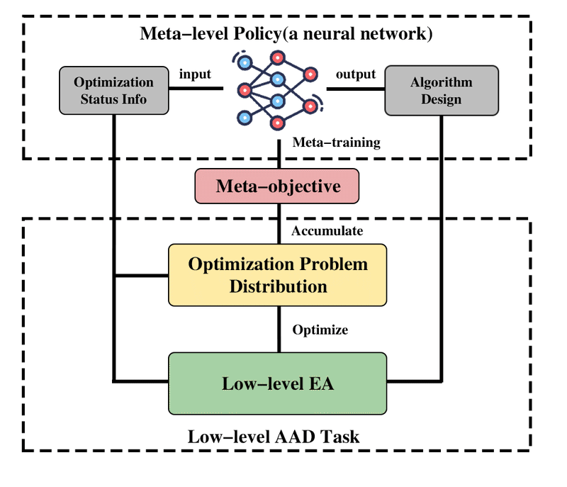

# Core Concept

> 💡 **MetaBox is an all-in-one platform for using and developing the algorithms in Meta-Black-Box Optimization (MetaBBO)**. 💡

MetaBBO, an emerging research direction in recent years, aims to automate the design of BBO algorithms by constructing intelligent agents as replacements for human experts. Its dual-layer architecture synergizes:

- Low-level​​: Standard BBO algorithms for solving optimization problems.
- Meta-level​​: A parameterized AI agent that adjusts low-level algorithms in real-time based on their optimization status info.

  

In low-level optimization environment, a BBO optimizer  $\mathcal{A}$  is maintained to optimize a problem  $p$  sampled from distribution  $\mathcal{P}$ . At each optimization step  $t$ , optimization status features are extracted from the current optimization process (such as population and objective values information). Then in meta-level, an algorithm design policy  $\pi_{\theta}$  (with learnable parameters  $\theta$) outputs a desired design  $\omega_{i}^{t}$  by  $\omega_{i}^{t}=\pi_{\theta}\left(s_{i}^{t}\right)$.  $\mathcal{A}$  optimizes  $p$  by  $\omega_{i}^{t}$  for one step. A performance measurement function  $r_{t}$  is used to evaluate the performance gain obtained by this algorithm design decision. Suppose  $T$  optimization steps are allowed for the low-level optimization process, then  $\pi_{\theta}$  is meta-trained to maximize a meta-objective formulated as:  $J(\theta)$ = $E_{p \in \mathcal{P}}$ \[ $\sum_{t=1}^{T} r_{t}$ \] , which is expectation of accumulated single step performance gain over all problem instances in  $\mathcal{P}$. In practice, a training problem set serves as
Through meta-learning on target problem distribution, MetaBBO shifts from human-expertise-driven design to data-driven automation, delivering unprecedented generalization power and design efficiency, and the performance exceeds that of traditional BBO.

For further exploration:
|Name|Describe|
|----|--------|
|[Toward Automated Algorithm Design: A Survey and Practical Guide to Meta-Black-Box-Optimization](https://arxiv.org/abs/2411.00625)|A comprehensive survey of MetaBBO|
|[Meta-Black-Box Optimization for Evolutionary Algorithms: Review and Perspective](https://papers.ssrn.com/sol3/papers.cfm?abstract_id=4956956)|A comprehensive survey of MetaBBO applied to EAs|
|[MetaBox: A Benchmark Platform for Meta-Black-Box Optimization with Reinforcement Learning](https://proceedings.neurips.cc/paper_files/paper/2023/hash/232eee8ef411a0a316efa298d7be3c2b-Abstract-Datasets_and_Benchmarks.html)|A comprehensive platform of MetaBBO|
|[PlatMetaX: An Integrated MATLAB platform for Meta-Black-Box Optimization](https://arxiv.org/pdf/2503.22722)|A MATLAB platform of MetaBBO|
|[Awesome-MetaBBO](https://github.com/GMC-DRL/Awesome-MetaBBO)|A repository of MetaBBO-related research papers and code implementations|

